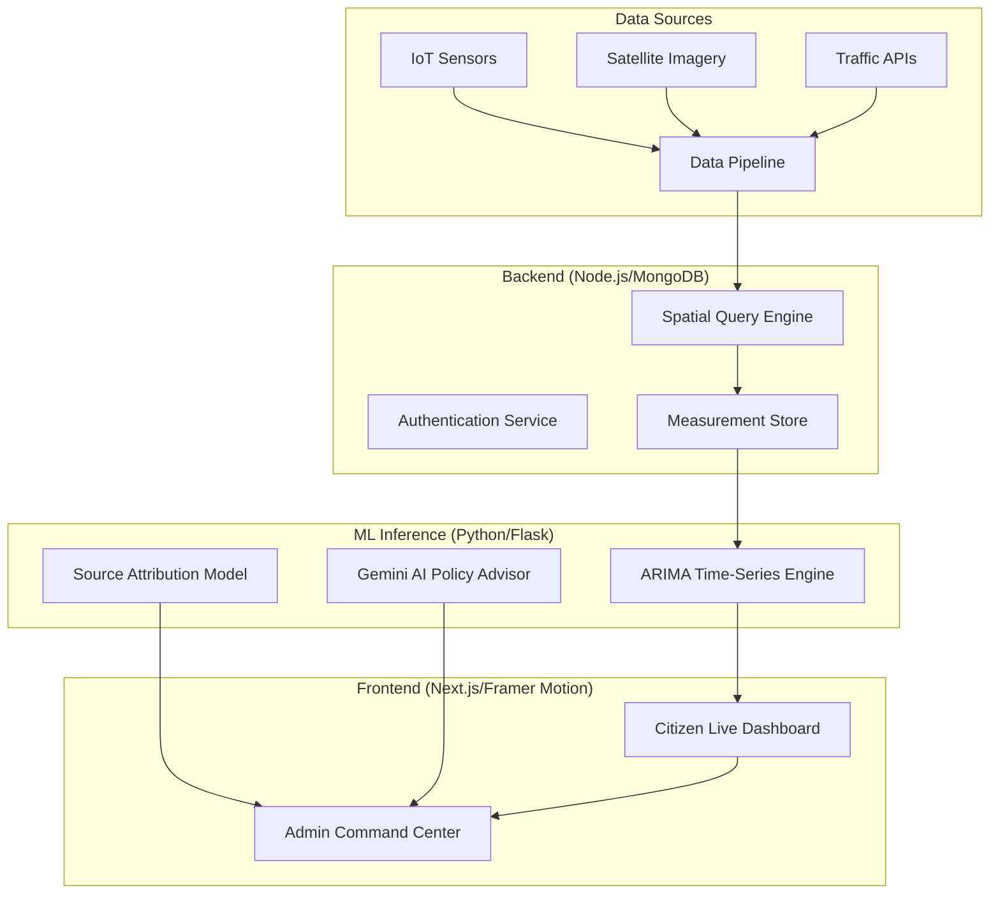

# 🌬️ AirLens: AI-Driven Urban Air Quality Intelligence

[](https://opensource.org/licenses/MIT)
[](https://flask.palletsprojects.com/)
[](https://nextjs.org/)
[](https://nodejs.org/)

**AirLens** is an advanced, hyper-local air quality monitoring and predictive intelligence platform. It moves beyond generic city-wide averages by utilizing spatial data engineering and time-series forecasting to provide neighborhood-level pollution insights.

---

## 🏗️ System Architecture & Workflow

AirLens operates as a distributed system across three core layers: Data Ingestion/Processing, ML Inference, and Live Visualization.



---

## 🧠 Machine Learning Engine

### 📈 Time-Series Forecasting: ARIMA Model
AirLens employs the **ARIMA (AutoRegressive Integrated Moving Average)** model to provide high-accuracy 24-hour AQI forecasts. Unlike simple linear models, ARIMA is specifically designed to understand the complex temporal dependencies in environmental data.

*   **AR (AutoRegressive)**: Leverages the relationship between an observation and a number of lagged observations (past AQI trends).
*   **I (Integrated)**: Uses differencing of raw observations to make the time series stationary, removing seasonal or daily bias.
*   **MA (Moving Average)**: Incorporates the dependency between an observation and a residual error from a moving average model applied to lagged observations.

**Why ARIMA?** It excels at capturing the "inertia" of air pollution — where current stagnant air or wind patterns strongly influence the immediate future, allowing for proactive health alerts before pollution spikes occur.

### 🤖 Generative AI Integration
AirLens integrates **Google Gemini Pro** to translate raw chemical data into actionable policy recommendations for administrators. It analyzes PM2.5/NO2 ratios and automatically suggests interventions like "Halting non-essential construction" or "Implementing traffic diversions" based on detected pollution causes.

---

## 🛠️ Key Technical Features

### 1. The Premium Landing Page (`/`)
*   **Spatial Data Flow**: 6-stage animated pipeline demonstrating live data ingestion.
*   **Problem Visualization**: Animated comparison between "Standard City AQI" and "AirLens Hyper-Local Mapping."
*   **Glassmorphism UI**: High-end SaaS aesthetic with deep-space dark mode and `framer-motion` micro-interactions.

### 2. Digital Twin Dashboard (`/admin/dashboard`)
*   **Live Spatial Heatmap**: Interactive mapping of pollution clusters using sensor nodes.
*   **Source Attribute Panel**: ML-based detection of primary pollutants (Vehicular vs. Industrial).
*   **Policy Command Center**: AI-generated health advisories and containment strategies.

---

## ⚙️ Tech Stack

- **Frontend**: Next.js 15 (App Router), Tailwind CSS v4, Framer Motion, Lucide React.
- **Backend**: Node.js, Express, MongoDB/Mongoose, JWT Authentication.
- **ML Service**: Python 3.10, Flask, Scikit-Learn, Statsmodels (ARIMA), Gemini 1.5 Flash.

---

## 🚀 Installation & Setup

### 1. Backend & Frontend
```bash
# Setup Backend
cd backend && npm install
cp .env.example .env # Add your keys
npm run dev

# Setup Frontend
cd frontend && npm install
npm run dev
```

### 2. ML Service
```bash
cd ml-service
python -m venv venv
source venv/bin/activate # or .\venv\Scripts\activate on Windows
pip install -r requirements.txt
python app.py
```

---

*Built for a cleaner, more intelligent urban future.*
